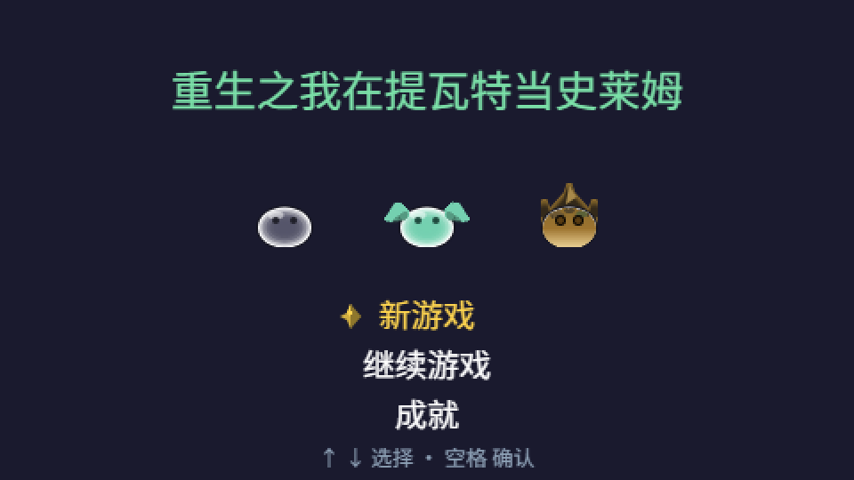
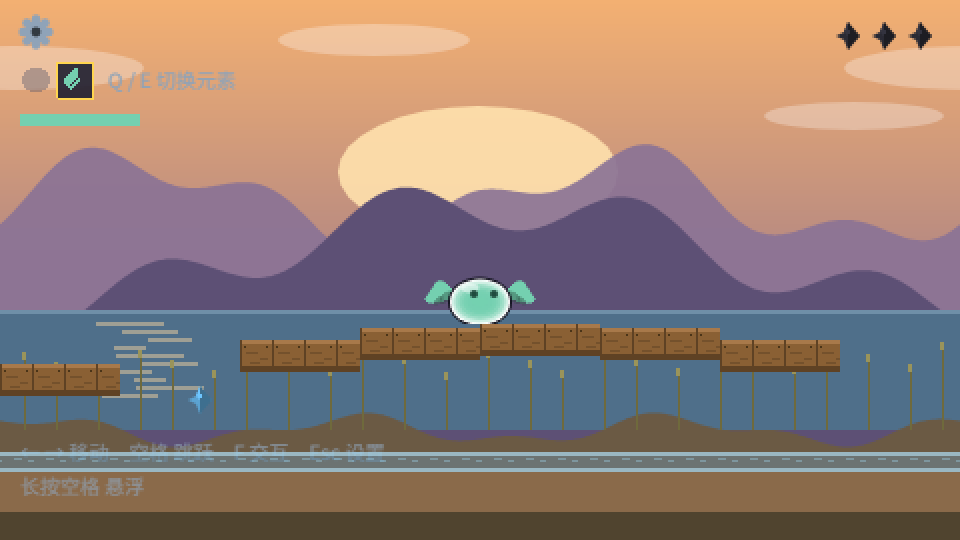
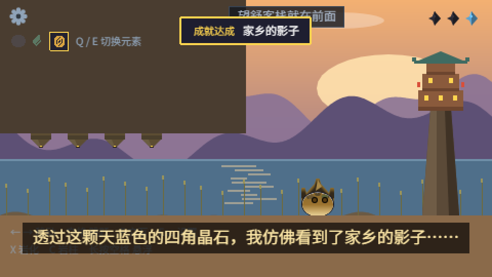

# 重生之我在提瓦特当史莱姆

一只从星间旅行坠落到提瓦特的史莱姆，摸到七天神像就能吸收对应的元素力——外貌、移速、
能力都会跟着变。目前做完六关：蒙德的海滩与风车、教堂、高空、一座五层的塔（塔顶救了条龙），
最后一路走到璃月·荻花洲的望舒客栈。

2D 像素风横版冒险解谜，**项目里没有任何外部美术素材**：全部贴图都是启动时用代码
（Phaser 的 Graphics）画出来的，音频里除六个 CC0 音效外也都是脚本合成的。

引擎 **Phaser 4**，构建 **Vite 8**，语言 **TypeScript 6**，逻辑分辨率固定 480×270。



| 荻花洲的拱形木桥 | 望舒客栈 |
|---|---|
|  |  |

## 怎么玩

| 操作 | 键鼠 |
|---|---|
| 左右移动 | `←` `→` |
| 跳跃 | `空格` |
| 悬浮 / 缓降（风元素） | 长按 `空格` / 松开 |
| 交互（神像、宝箱、残卷、方碑） | `F` |
| 切换元素 | `Q` / `E` |
| 岩化（岩元素） | `X` |
| 立岩柱（岩元素） | `C`（短按直接放，长按进预览、再按一次落柱） |
| 暂停 / 设置 | `Esc` |

手机、平板等触摸设备会自动出现一整套虚拟按键（左右 / 跳跃 / 岩柱 / 岩化），
元素图标可以直接点着切，靠近物件时点提示条就等于按 F。
手机上竖着拿会提示「把手机横过来玩」，点一下可以试着锁定横屏。

## 怎么跑起来

需要 Node.js 18 以上。

```bash
npm install       # 安装依赖
npm run dev       # 开发：浏览器打开 http://localhost:5173
npx tsc --noEmit  # 只做类型检查，没输出就是通过
npm run build     # 打包到 dist/
node 打包单文件.mjs  # 把整个游戏压成一个 game.html，双击即玩、可以直接发给别人
```

手机上试：`npm run dev -- --host`，用手机连同一个 Wi-Fi 打开终端里给出的 Network 地址
（或者装好之后在地址后面加 `?touch=1`，桌面浏览器也会铺出虚拟按键）。

调试用的地址参数：`?reset=1` 清一次档，`?fresh=1` 这次不读也不写存档。

## 目录结构

```
src/
  main.ts                  入口与全局配置（画布尺寸、物理、场景列表）
  data/elements.ts         元素的颜色、跳跃、移速、能力
  data/levels.ts           六关的全部关卡数据 + 各主题的地形配色表
  state/progress.ts        存档（localStorage、3 个槽、版本号、开发者开关）
  state/achievements.ts    成就表与解锁逻辑
  state/audio.ts           音效与背景音乐
  state/touch.ts           触屏判断与提示文案适配
  scenes/BootScene.ts      生成全部程序化贴图
  scenes/MenuScene.ts      标题页
  scenes/SaveScene.ts      存档槽界面
  scenes/SelectScene.ts    选关界面
  scenes/GameScene.ts      玩法主场景（最大的一个文件）
  scenes/PauseScene.ts     暂停 / 设置
  scenes/DeadScene.ts      死亡界面
  scenes/ResultScene.ts    结算界面
  scenes/Achievement*.ts   成就提示条与成就查看页
public/sfx, public/bgm     音效与背景音乐（附来源说明）
docs/                      README 用的截图
开发笔记.md                 逐日开发记录：做完了什么、踩过哪些坑、下一步
```

## 设计笔记

[`开发笔记.md`](开发笔记.md) 是这个项目真正的"说明书"：每一关的坐标、每个数据字段的含义、
二十九条踩过的坑（比如"编译通过不等于能跑""摆台阶先算高度差"）都在里面，
想接着往下做的话建议先读它。

## 授权与致谢

- 本仓库中作者原创的代码、贴图、音频：**MIT**，见 [LICENSE](LICENSE)
- 引擎 **Phaser 4**（MIT）、以及音效素材来源：见 [NOTICE.md](NOTICE.md)
- 六个音效取自 [Kenney](https://kenney.nl) 的 CC0 素材包，这里一并致谢

## 同人声明

这是**非官方的同人习作**，用到了《原神》的世界观名词（提瓦特、望舒客栈、七神赐予元素等），
这些名称与设定的版权归米哈游所有。本项目仅供学习与交流，**请勿用于任何商业用途**，
与米哈游及《原神》官方没有任何关系。如果你是版权方并认为这里有不妥之处，请联系我处理。
